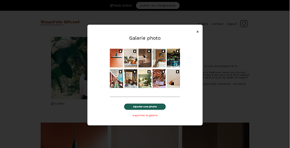

## Description

Partie frontend d'un portfolio d'une architecte d'intérieur, réalisé en Javascript. Utilisation d'une API : fetch, promises.  

Manipulation du DOM : ajout, modifier et supprimer des éléments du DOM. 

**Tags**: *fetch, pomises, DOM*

  

## Installation

__Etape 1__: Cloner la partie backend du site [https://github.com/AvirKarakitsos/OC_project3_backend](https://github.com/AvirKarakitsos/OC_project3_backend)

__Etape2__: Penser à modifier le fichier *config.json* si vous n'utiliser pas liverserver

__Etape3__: L'email et le mot de passe sont disponibles dans le fichier *config.json*

